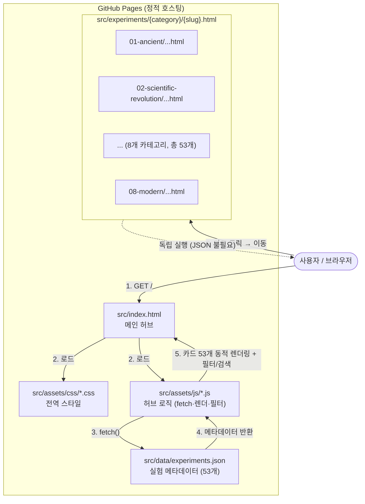
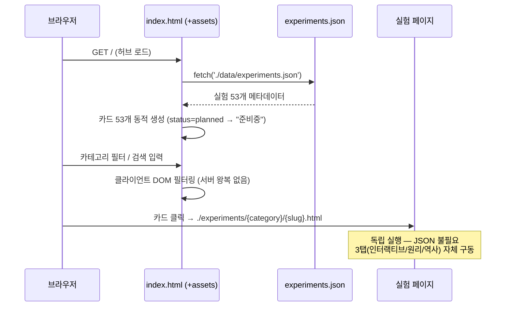
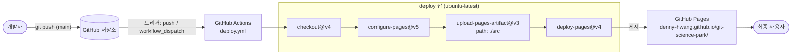

# 아키텍처 (Architecture)

Git Science Park의 시스템 아키텍처 문서입니다. 전체 구조, 기술 스택, 파일 구성, 데이터 흐름, URL 구조, 배포 파이프라인, 브라우저 지원 범위를 정의합니다.

> 한 줄 요약: **순수 정적(서버리스) 웹사이트**로, 외부 라이브러리 없이(Zero Dependencies) HTML5 + CSS3 + Vanilla JavaScript(ES6+)만으로 구현하며, GitHub Pages에서 호스팅하고 GitHub Actions로 자동 배포한다.

---

## 1. 시스템 개요

Git Science Park는 과학사의 핵심 실험 **53개**를 "조작 → 관찰 → 해석" 흐름으로 직접 다루며 배우는 인터랙티브 학습 플랫폼이다. 시스템의 핵심 설계 원칙은 다음과 같다.

- **서버리스 / 순수 정적**: 백엔드·데이터베이스·런타임 서버가 전혀 없다. 모든 자산은 정적 파일이며 브라우저에서만 동작한다.
- **Zero Dependencies**: 프레임워크, UI 라이브러리, 번들러, 빌드 도구를 사용하지 않는다. 표준 웹 플랫폼 API만 사용한다.
- **오프라인 실행 가능**: 파일을 로컬에서 열어도(또는 정적 서버로 서빙해도) 동작한다.
- **실험의 독립성**: 각 실험은 단일 HTML 파일로 자기완결적이며, 허브와 무관하게 단독 실행할 수 있다.

전체 동작 구조는 다음과 같다. 브라우저는 먼저 메인 허브(`index.html`)를 로드하고, 허브는 메타데이터 파일(`experiments.json`)을 `fetch`로 읽어 실험 카드 53개를 동적으로 렌더링한다. 사용자가 카드를 클릭하면 해당 실험의 독립 HTML 페이지로 이동하며, 이 페이지는 더 이상 메타데이터에 의존하지 않고 자체적으로 동작한다.



---

## 2. 기술 스택

| 영역 | 기술 | 비고 |
| --- | --- | --- |
| 마크업 | **HTML5** | 시맨틱 태그, 단일 파일 실험 페이지 |
| 스타일 | **CSS3** | Flexbox/Grid, CSS 변수(테마 컬러), 반응형(미디어 쿼리) |
| 로직 | **Vanilla JavaScript (ES6+)** | 모듈/화살표 함수/`fetch`/`async-await`. 프레임워크 없음 |
| 2D 시뮬레이션 | **Canvas API** | 물리/기하 인터랙티브 시뮬레이션 렌더링 |
| 다이어그램 | **SVG** | 정적/벡터 도식, 장치 구조도 |
| 외부 라이브러리 | **없음 (Zero Dependencies)** | 번들러·패키지 매니저·CDN 의존성 모두 미사용 |

설계상 의도된 비-목표(Non-Goals)는 다음과 같다.

- npm/yarn 등 패키지 매니저 및 `node_modules` 사용하지 않음
- Webpack/Vite/Rollup 등 번들러·트랜스파일러 사용하지 않음
- React/Vue/Svelte 등 SPA 프레임워크 사용하지 않음
- 서버 사이드 렌더링·API 서버·데이터베이스 사용하지 않음

이러한 제약은 "추가 설치 없이, 정적 파일만으로, 오프라인에서도 동작" 이라는 핵심 가치를 보장하기 위한 것이다.

---

## 3. 파일 구조

저장소는 문서(`docs/`), 소스(`src/`), 배포 워크플로우(`.github/`)로 구성된다. 배포 대상은 오직 `src/` 폴더이다.

```text
git-science-park/
├─ .github/
│  └─ workflows/
│     └─ deploy.yml              # GitHub Actions: main push 시 src/ 자동 배포
├─ docs/
│  └─ 02-design/
│     ├─ ARCHITECTURE.md         # (본 문서) 시스템 아키텍처
│     ├─ DATA-MODEL.md           # 데이터 모델 / experiments.json 스키마
│     ├─ EXPERIMENT-TEMPLATE.md  # 실험 페이지 템플릿 규약
│     └─ UI-DESIGN.md            # UI/UX 디자인 가이드
├─ src/                          # ★ 배포 루트 (GitHub Pages 아티팩트)
│  ├─ index.html                 # 메인 허브 (카드 목록·필터·검색)
│  ├─ data/
│  │  └─ experiments.json        # 실험 53개 메타데이터 (단일 진실 공급원)
│  ├─ assets/
│  │  ├─ css/                    # 전역 스타일시트
│  │  └─ js/                     # 허브 로직 (fetch·렌더링·필터)
│  └─ experiments/               # 카테고리별 실험 페이지 (8개 카테고리)
│     ├─ 01-ancient/             # 🏛️ 고대 — 4개
│     ├─ 02-scientific-revolution/  # 🔭 과학혁명 — 7개
│     ├─ 03-precision-era/       # ⚗️ 18세기 — 5개
│     ├─ 04-energy-field/        # 🔥 19세기 — 7개
│     ├─ 05-atomic/              # ⚛️ 원자의 시대 — 9개
│     ├─ 06-quantum/             # 🌊 양자역학 — 7개
│     ├─ 07-relativity/          # 🌌 상대성·우주론 — 7개
│     └─ 08-modern/              # 🔬 현대 물리학 — 7개
├─ CHANGELOG.md
├─ CONTRIBUTING.md
└─ LICENSE
```

### 주요 구성요소의 역할

| 경로 | 역할 |
| --- | --- |
| `src/index.html` | 메인 허브. 페이지 골격과 진입점 스크립트를 포함하고, 실험 카드 그리드·카테고리 필터·검색 UI를 호스팅한다. |
| `src/data/experiments.json` | 실험 메타데이터의 **단일 진실 공급원(Single Source of Truth)**. 허브가 이 파일을 읽어 카드를 만든다. |
| `src/assets/css/` | 전역 디자인 토큰(카테고리 컬러 등)과 반응형 레이아웃 스타일. |
| `src/assets/js/` | 허브 동작 로직: `experiments.json` `fetch`, 카드 DOM 생성, 필터/검색 처리. |
| `src/experiments/{category}/{slug}.html` | 개별 실험 페이지. 각각 자기완결형 단일 HTML 파일이며 허브/JSON에 의존하지 않는다. |

### 파일/경로 명명 규약

- 실험 페이지 파일 경로: `src/experiments/{category}/{slug}.html`
- `slug` 형식: 카테고리별로 `01`부터 시작하는 2자리 일련번호 + 영문 슬러그 (예: `01-eratosthenes`)
- 예시 경로: `src/experiments/01-ancient/01-eratosthenes.html`
- 허브에서의 링크 경로(상대 경로): `./experiments/{category}/{slug}.html`

### 실험 페이지 내부 구조 (3탭)

각 실험 페이지는 다음 3개의 탭으로 구성된다.

1. 🎮 **인터랙티브** — Canvas/SVG 기반 시뮬레이션을 조작·관찰
2. 📚 **원리 학습** — 실험의 과학적 원리와 수식 설명
3. 📜 **역사적 맥락** — 실험이 이루어진 시대·인물·의의

---

## 4. 데이터 흐름

데이터는 단방향으로 흐르며, 허브와 개별 실험 페이지의 데이터 의존성이 분리되어 있는 것이 특징이다.

1. **허브 진입**: 브라우저가 `index.html`을 로드하면 `assets/js`의 진입 스크립트가 실행된다.
2. **메타데이터 로드**: 스크립트가 `fetch('./data/experiments.json')`로 실험 메타데이터를 비동기 로드한다.
3. **카드 동적 생성**: 로드된 배열을 순회하며 실험 카드 DOM을 생성해 그리드에 삽입한다. 각 카드는 카테고리 컬러·난이도(`difficulty` 1~5, ⭐ 표기)·제목·`status`를 표시하고, `./experiments/{category}/{slug}.html`로 향하는 링크를 가진다.
4. **상태 반영**: 현재 모든 실험은 미구현 상태이므로 `status=planned`이며, 허브에서는 "준비중"으로 비활성 표시된다. (`status`: `ready | planned | in-progress`)
5. **필터/검색**: 카테고리 필터와 키워드 검색은 모두 클라이언트 JS에서 처리한다. 서버 왕복 없이 이미 렌더링된 카드들의 표시/숨김을 토글하는 **DOM 필터링** 방식이다.
6. **실험 페이지 이동**: 카드 클릭 시 독립 실험 HTML로 이동한다. 이 페이지는 `experiments.json`을 **필요로 하지 않으며**, 자체 인라인 스크립트/스타일로 3탭과 시뮬레이션을 구동한다.



> 데이터 책임 분리: `experiments.json`은 **카탈로그(목록)** 의 진실 공급원이고, 각 실험의 **콘텐츠·시뮬레이션 로직**은 해당 실험 HTML 파일 내부에 자기완결적으로 존재한다.

---

## 5. URL 구조

GitHub Pages는 `src/`를 사이트 루트로 배포한다. 따라서 배포 URL(`https://denny-hwang.github.io/git-science-park/`) 기준의 경로는 다음과 같다.

| URL (논리 경로) | 매핑되는 파일 | 설명 |
| --- | --- | --- |
| `/` | `src/index.html` | 메인 허브 (실험 카드 목록·필터·검색) |
| `/data/experiments.json` | `src/data/experiments.json` | 실험 메타데이터 (허브가 fetch) |
| `/experiments/01-ancient/01-eratosthenes.html` | `src/experiments/01-ancient/01-eratosthenes.html` | 개별 실험 페이지 (예시) |
| `/experiments/{category}/{slug}.html` | `src/experiments/{category}/{slug}.html` | 개별 실험 페이지 일반형 |
| `/assets/css/...`, `/assets/js/...` | `src/assets/...` | 전역 스타일·스크립트 |

- 라우팅은 **파일 시스템 기반**이다. 클라이언트 사이드 라우터(SPA 라우팅)를 쓰지 않으므로 `History API`/해시 라우팅 없이 실제 파일 경로가 곧 URL이다.
- 모든 내부 링크는 **상대 경로**(`./experiments/...`)를 사용하므로 GitHub Pages의 프로젝트 하위 경로(`/git-science-park/`)에서도, 로컬/오프라인에서도 동일하게 동작한다.

---

## 6. 배포

배포는 `main` 브랜치 push를 트리거로 하는 GitHub Actions 워크플로우(`.github/workflows/deploy.yml`)가 전담한다. 빌드 단계가 없으며, `src/` 폴더를 그대로 GitHub Pages 아티팩트로 업로드한다.

### 워크플로우 동작 요약

- **트리거**: `main` 브랜치 `push` (및 수동 실행 `workflow_dispatch`)
- **권한**: `contents: read`, `pages: write`, `id-token: write`
- **동시성**: `group: pages`, `cancel-in-progress: true` (중복 실행 취소)
- **잡 단계**:
  1. `actions/checkout@v4` — 저장소 체크아웃
  2. `actions/configure-pages@v5` — Pages 환경 설정
  3. `actions/upload-pages-artifact@v3` — `path: ./src` 폴더를 아티팩트로 업로드
  4. `actions/deploy-pages@v4` — GitHub Pages로 배포 (`environment: github-pages`)



> 핵심: 별도의 빌드/번들 단계가 없다. `src/`의 정적 파일이 곧 배포물이므로, 로컬에서 `src/index.html`을 열어 확인한 결과가 운영 환경과 동일하다.

---

## 7. 브라우저 지원

표준 웹 플랫폼 API(ES6+, `fetch`, Canvas, SVG, CSS Grid/Flexbox/변수)를 사용하므로 최신 브라우저를 대상으로 한다.

| 브라우저 | 최소 버전 |
| --- | --- |
| Google Chrome | 90+ |
| Mozilla Firefox | 88+ |
| Apple Safari | 14+ |
| Microsoft Edge | 90+ |
| Internet Explorer | **미지원** |

- 반응형으로 설계되어 모바일·태블릿·데스크톱 화면에 모두 대응한다.
- IE는 ES6+/`fetch`/CSS 변수 등을 지원하지 않으므로 대상에서 제외한다.

---

## 부록: 아키텍처 한눈에 보기

| 항목 | 결정 |
| --- | --- |
| 호스팅 | GitHub Pages (정적, 서버리스) |
| 빌드 | 없음 (`src/`를 그대로 배포) |
| 의존성 | 없음 (Zero Dependencies) |
| 라우팅 | 파일 시스템 기반, 상대 경로 |
| 데이터 | `src/data/experiments.json` (카탈로그 단일 공급원) |
| 콘텐츠 | 실험별 자기완결형 단일 HTML |
| 카테고리 / 실험 수 | 8개 카테고리 / 총 53개 |
| 배포 트리거 | `main` push → GitHub Actions |
