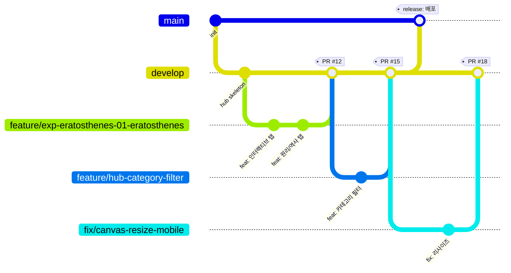

# Git 워크플로우 (Git Workflow)

Git Science Park(과학사 인터랙티브 실험실)의 Git 브랜치 전략, 커밋 컨벤션, Pull Request 규칙, 브랜치 보호 규칙을 정의한다. 이 문서는 53개 실험과 허브를 여러 명이 동시에 개발하면서도 `main` 브랜치의 안정성과 자동 배포 품질을 보장하기 위한 공통 규약이다.

## 목차

1. [브랜치 전략](#1-브랜치-전략)
2. [커밋 컨벤션](#2-커밋-컨벤션)
3. [Pull Request 규칙](#3-pull-request-규칙)
4. [브랜치 보호 규칙](#4-브랜치-보호-규칙)
5. [실전 워크플로우 예시](#5-실전-워크플로우-예시)

---

## 1. 브랜치 전략

본 프로젝트는 단순화한 **Git Flow** 변형을 사용한다. `main`은 GitHub Pages로 자동 배포되는 프로덕션 브랜치이고, `develop`은 다음 릴리스를 통합하는 브랜치이며, 모든 실제 작업은 단명(short-lived) 토픽 브랜치에서 진행한 뒤 PR로 합친다.

### 1.1 브랜치 종류

| 브랜치 | 역할 | 분기 기준(from) | 병합 대상(into) | 수명 | 비고 |
| --- | --- | --- | --- | --- | --- |
| `main` | 프로덕션. push 시 GitHub Actions(`.github/workflows/deploy.yml`)가 `src/`를 GitHub Pages로 자동 배포 | — | — | 영구 | 직접 push 금지, 항상 배포 가능 상태 유지 |
| `develop` | 통합 브랜치. 검증된 기능을 모아 다음 릴리스 후보를 구성 | `main` | `main` | 영구 | 기본 PR 타깃 |
| `feature/exp-{id}-{slug}` | 개별 실험 페이지 개발 | `develop` | `develop` | 단명 | 실험 1개 = 브랜치 1개 |
| `feature/hub-*` | 허브(`src/index.html`) 기능 개발 | `develop` | `develop` | 단명 | 검색/필터/카테고리 등 |
| `fix/*` | 버그 수정 | `develop` | `develop` | 단명 | 긴급 시 `hotfix/*`로 `main`에서 분기 가능 |
| `docs/*` | 문서 작성/수정 | `develop` | `develop` | 단명 | `docs/` 폴더 등 |
| `chore/*` | 빌드/설정/저장소 잡무 | `develop` | `develop` | 단명 | 워크플로우, 라이선스 등 |
| `hotfix/*` | 프로덕션 긴급 수정 | `main` | `main` + `develop` | 단명 | 배포된 치명적 버그 한정 |

### 1.2 브랜치 네이밍 규칙

- 모두 소문자, 단어 구분은 하이픈(`-`).
- 실험 브랜치는 **카테고리 내 일련번호뿐 아니라, 추적 가능한 실험 식별자**와 `slug`를 함께 쓴다. id는 `experiments.json`의 실험 식별자를 따른다.
- 한 브랜치는 한 가지 목적만 담는다(실험 1개, 버그 1건 등).

| 작업 종류 | 패턴 | 예시 |
| --- | --- | --- |
| 실험 개발 | `feature/exp-{id}-{slug}` | `feature/exp-eratosthenes-01-eratosthenes` |
| 허브 기능 | `feature/hub-{topic}` | `feature/hub-category-filter` |
| 버그 수정 | `fix/{topic}` | `fix/canvas-resize-mobile` |
| 문서 | `docs/{topic}` | `docs/git-workflow` |
| 잡무 | `chore/{topic}` | `chore/update-deploy-action` |
| 핫픽스 | `hotfix/{topic}` | `hotfix/broken-pages-link` |

> 실험 페이지 경로 규칙(`src/experiments/{category}/{slug}.html`)과 브랜치명을 일치시키면 추적이 쉽다. 예: 브랜치 `feature/exp-eratosthenes-01-eratosthenes` → 파일 `src/experiments/01-ancient/01-eratosthenes.html`.

### 1.3 브랜치 흐름 (Mermaid gitGraph)



### 1.4 전체 데이터 흐름 (개념도)

```text
  topic 브랜치              develop                main                GitHub Pages
  ───────────              ───────                ────                ────────────
  feature/exp-* ─┐
  feature/hub-* ─┼──PR──▶  통합/검증  ──release PR──▶  배포 가능   ──push 트리거──▶  자동 배포
  fix/*         ─┘                                  (deploy.yml)     (src/ → Pages)
  docs/*, chore/* ┘

  hotfix/* ───────────────────────────PR──────────▶  긴급 수정  ───┐
        └──────────────back-merge──────────────────────────────────┘ (develop로 되돌려 병합)
```

`main`에 commit이 들어가는 순간 `deploy.yml`이 실행되어 `src/` 폴더가 그대로 Pages로 배포된다(빌드 단계 없음 — Zero Dependencies 정적 사이트). 따라서 **`main`은 언제나 배포 가능한 상태여야 한다.**

---

## 2. 커밋 컨벤션

[Conventional Commits](https://www.conventionalcommits.org/) 규약을 따른다. 자동 변경 이력 정리, 리뷰 용이성, squash merge 시 깔끔한 메시지 생성을 위해 모든 커밋이 이 형식을 지킨다.

### 2.1 형식

```text
type(scope): subject

[optional body]

[optional footer]
```

- **type**: 변경의 종류(아래 표). 필수.
- **scope**: 영향 범위. 선택이지만 권장. 실험은 `slug`, 허브는 `hub`, 데이터는 `data` 등.
- **subject**: 명령형 현재시제, 50자 이내, 마침표로 끝내지 않음. 한국어 또는 영어 모두 허용하되 한 저장소 내 일관성 유지.
- **body**: 변경 이유/맥락. 한 줄당 72자 권장.
- **footer**: 이슈 연결(`Closes #12`), 호환성 깨짐(`BREAKING CHANGE:`) 등.

### 2.2 type 목록

| type | 용도 | 예시 scope |
| --- | --- | --- |
| `feat` | 새 기능/실험/탭 추가 | `01-eratosthenes`, `hub` |
| `fix` | 버그 수정 | `canvas`, `hub`, 실험 slug |
| `docs` | 문서 변경(코드 영향 없음) | `git-workflow`, `readme` |
| `style` | 포맷팅/공백/세미콜론 등 동작 변화 없는 변경 | `css`, `hub` |
| `refactor` | 동작 변화 없는 구조 개선 | `physics-engine`, `data` |
| `test` | 테스트 추가/수정 | `hub` |
| `chore` | 빌드/설정/의존성/저장소 잡무 | `deploy`, `gh-actions` |
| `perf` | 성능 개선 | `canvas`, `render` |

### 2.3 커밋 예시

**실험 개발 (feat)**

```text
feat(01-eratosthenes): 그림자 각도 슬라이더 인터랙티브 탭 구현

- Canvas로 두 도시의 막대 그림자를 실시간 렌더링
- 슬라이더 조작 시 지구 둘레 추정값을 즉시 계산/표시
- 조작 → 관찰 → 해석 흐름에 맞춰 단계별 안내 추가

Closes #12
```

```text
feat(05-millikan): 기름방울 실험 원리 학습 탭 추가
```

**허브 기능 (feat)**

```text
feat(hub): 카테고리별 필터 및 난이도 정렬 기능 추가
```

```text
feat(data): experiments.json에 양자역학 7개 실험 메타데이터 등록
```

**버그 수정 (fix)**

```text
fix(canvas): 모바일에서 화면 회전 시 캔버스 해상도 깨지는 문제 수정

devicePixelRatio 반영이 resize 이벤트에서 누락되어 흐릿하게 보이던 문제.
ResizeObserver로 교체하여 회전/리사이즈 모두 대응.
```

```text
fix(hub): planned 상태 실험 카드 클릭 시 빈 페이지로 이동하던 버그 수정
```

**문서 / 잡무 / 성능**

```text
docs(git-workflow): 브랜치 전략 및 커밋 컨벤션 문서 작성
```

```text
chore(deploy): deploy-pages 액션을 v4로 업그레이드
```

```text
perf(canvas): requestAnimationFrame 디바운싱으로 시뮬레이션 프레임 최적화
```

### 2.4 좋은 / 나쁜 커밋 비교

| 나쁜 예 | 문제 | 좋은 예 |
| --- | --- | --- |
| `update` | type·scope·내용 없음 | `feat(hub): 검색 입력창 추가` |
| `버그 고침` | 무엇을 고쳤는지 불명확 | `fix(03-cavendish): 진자 주기 계산 오차 수정` |
| `feat: 여러 작업 한꺼번에` | 한 커밋에 여러 목적 | 변경을 목적별로 분리하여 커밋 |
| `Fixed Bug.` | 마침표·과거시제 | `fix(canvas): 리사이즈 시 컨텍스트 손실 방지` |

---

## 3. Pull Request 규칙

모든 변경은 PR을 통해서만 통합한다. 토픽 브랜치 → `develop` PR, 그리고 릴리스 시 `develop` → `main` PR을 연다.

### 3.1 PR 제목

커밋 컨벤션과 동일한 형식을 사용한다. squash merge 시 이 제목이 최종 커밋 메시지가 되므로 신중히 작성한다.

```text
feat(01-eratosthenes): 에라토스테네스 지구 둘레 측정 실험 페이지 완성
```

### 3.2 PR 설명 템플릿

`.github/pull_request_template.md`에 아래 템플릿을 두고 모든 PR이 이를 채운다.

```markdown
## 요약
<!-- 무엇을, 왜 변경했는지 1~3문장 -->

## 변경 사항
- 

## 관련 이슈
Closes #

## 스크린샷 / GIF
<!-- 인터랙티브 동작이 보이도록 (실험/허브 변경 시 필수) -->

## 체크리스트
### 공통
- [ ] 브랜치명·커밋이 컨벤션을 따른다
- [ ] 셀프 머지를 하지 않으며 리뷰어를 1명 이상 지정했다
- [ ] Zero Dependencies 원칙 준수 (외부 라이브러리/프레임워크/빌드 도구 미사용)

### 실험 페이지 (해당 시)
- [ ] `src/experiments/{category}/{slug}.html` 경로/네이밍 규칙 준수
- [ ] `src/data/experiments.json` 메타데이터 스키마 준수 (difficulty 1~5, status 등)
- [ ] 3개 탭 모두 충족: 🎮 인터랙티브 / 📚 원리 학습 / 📜 역사적 맥락
- [ ] "조작 → 관찰 → 해석" 학습 흐름이 동작한다
- [ ] 허브 링크 경로(`./experiments/{category}/{slug}.html`)가 올바르다

### 품질
- [ ] 반응형 확인 (모바일 / 태블릿 / 데스크톱)
- [ ] 크로스 브라우저 확인 (Chrome 90+, Firefox 88+, Safari 14+, Edge 90+)
- [ ] 콘솔 에러 없음, 오프라인에서도 동작
- [ ] (해당 시) 문서/주석을 최신 상태로 갱신
```

### 3.3 PR 정책 요약

| 항목 | 규칙 |
| --- | --- |
| 리뷰어 | 최소 1명 승인 필요 |
| 셀프 머지 | 금지 (본인 PR을 본인이 승인/머지하지 않음) |
| 병합 방식 | **Squash and merge 권장** (`develop` 이력 단순화). 릴리스(`develop`→`main`)는 Merge commit으로 추적성 유지 |
| 머지 전 | CI(자동 배포 워크플로우 등) 통과 + 타깃 브랜치 최신화 필수 |
| 머지 후 | 병합된 토픽 브랜치는 삭제 (`Delete branch` 자동화 권장) |
| 크기 | 가능한 작게. 실험 1개 단위 PR을 권장하며, 거대한 PR은 분할 |
| Draft | 작업 중에는 Draft PR로 열어 조기 피드백 수집 |

### 3.4 리뷰 가이드

리뷰어는 코드뿐 아니라 **실제 동작**을 확인한다.

- 실험 PR은 GitHub Pages 미리보기 또는 로컬에서 직접 열어 3탭과 인터랙션을 확인한다.
- 스키마(`experiments.json`)·경로 규칙·상태값(`ready`/`planned`/`in-progress`) 정합성을 점검한다.
- 외부 의존성이 새로 추가되지 않았는지(`Zero Dependencies`) 확인한다.

---

## 4. 브랜치 보호 규칙

GitHub 저장소 설정(Settings → Branches → Branch protection rules)에서 아래를 강제한다.

### 4.1 `main` 보호 규칙

| 설정 | 값 | 목적 |
| --- | --- | --- |
| Require a pull request before merging | ✅ | 직접 push 금지 |
| Required approvals | 1 이상 | 리뷰 없는 병합 차단 |
| Dismiss stale approvals on new commits | ✅ | 새 커밋 시 기존 승인 무효화 |
| Require status checks to pass | ✅ | CI 통과 필수 |
| Require branches to be up to date before merging | ✅ | 최신화 강제 (병합 전 타깃 반영) |
| Require linear history | ✅ (권장) | squash/rebase 기반 깔끔한 이력 |
| Do not allow bypassing the above settings | ✅ | 관리자도 규칙 준수 |
| Allow force pushes | ❌ | 이력 보호 |
| Allow deletions | ❌ | 브랜치 삭제 방지 |

> `main` push는 곧 프로덕션 배포(`deploy.yml`)다. 따라서 `main`으로의 변경은 반드시 `develop`(또는 `hotfix/*`)에서 올라온 검증된 PR을 통해서만 들어간다.

### 4.2 `develop` 정책

| 설정 | 값 | 목적 |
| --- | --- | --- |
| Require a pull request before merging | ✅ | 통합도 PR 경유 |
| Required approvals | 1 이상 | 리뷰 보장 |
| Require status checks to pass | ✅ | 깨진 코드 통합 방지 |
| Require branches to be up to date before merging | ✅ (권장) | 충돌 조기 해소 |
| Allow force pushes | ❌ | 공유 브랜치 안정성 |
| Allow deletions | ❌ | 영구 브랜치 보호 |

### 4.3 상태 체크(Required status checks)

배포 워크플로우는 `main` push 시 실행되므로, 추가로 PR 단계에서 동작하는 검증 워크플로우(예: HTML/JSON lint, 링크 검사)를 두고 이를 필수 체크로 지정하는 것을 권장한다. 이렇게 하면 `develop` PR 단계에서 문제를 걸러내어 `main` 배포 안정성을 높일 수 있다.

---

## 5. 실전 워크플로우 예시

### 5.1 새 실험 개발 (가장 흔한 흐름)

```bash
# 1. develop 최신화 후 분기
git checkout develop
git pull origin develop
git checkout -b feature/exp-eratosthenes-01-eratosthenes

# 2. 작업: 실험 페이지 + 메타데이터
#    src/experiments/01-ancient/01-eratosthenes.html
#    src/data/experiments.json (status, difficulty 등)

# 3. 목적 단위 커밋
git add src/experiments/01-ancient/01-eratosthenes.html
git commit -m "feat(01-eratosthenes): 그림자 각도 인터랙티브 탭 구현"

git add src/data/experiments.json
git commit -m "feat(data): 에라토스테네스 실험 메타데이터 등록"

# 4. 푸시 후 develop으로 PR 생성
git push -u origin feature/exp-eratosthenes-01-eratosthenes
# GitHub에서 base: develop ← compare: feature/... PR 생성, 템플릿/체크리스트 작성

# 5. 리뷰 1명 승인 + CI 통과 후 Squash and merge → 브랜치 삭제
```

### 5.2 릴리스 (develop → main 배포)

```bash
# develop이 충분히 검증되면 main으로 릴리스 PR
# GitHub에서 base: main ← compare: develop
#  - 리뷰 승인 + 상태 체크 통과 + 최신화 확인
#  - Merge commit으로 병합 (릴리스 추적성)
# main에 병합되는 즉시 deploy.yml이 src/를 GitHub Pages로 자동 배포
```

### 5.3 긴급 핫픽스 (배포된 버그)

```bash
git checkout main
git pull origin main
git checkout -b hotfix/broken-pages-link

# 수정 후 커밋
git commit -m "fix(hub): 배포 환경에서 깨진 실험 링크 경로 수정"
git push -u origin hotfix/broken-pages-link

# 1) main으로 PR → 리뷰/CI 후 병합 (즉시 재배포)
# 2) 동일 수정을 develop에도 back-merge 하여 분기 누락 방지
```

---

### 요약

- `main`은 배포(프로덕션), `develop`은 통합, 실제 작업은 `feature/*`·`fix/*`·`docs/*`·`chore/*` 토픽 브랜치에서.
- 모든 커밋·PR 제목은 Conventional Commits(`type(scope): subject`).
- PR은 리뷰 1명 이상, 셀프 머지 금지, Squash merge 권장, 체크리스트(스키마·3탭·반응형·크로스 브라우저) 충족.
- `main`/`develop`은 브랜치 보호로 직접 push·force push·삭제를 막고 PR + CI 통과 + 최신화를 강제한다.
